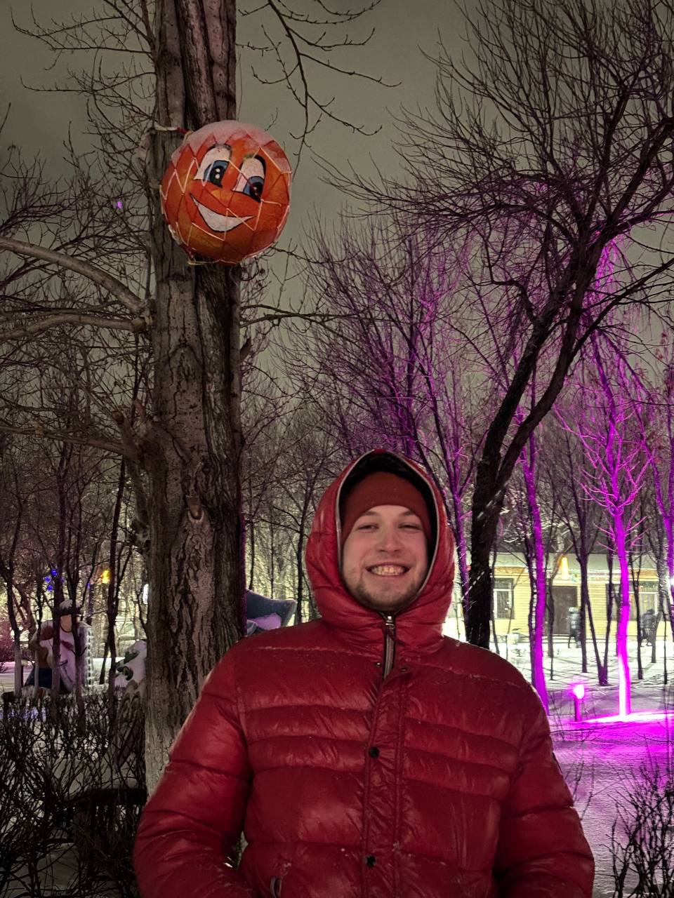
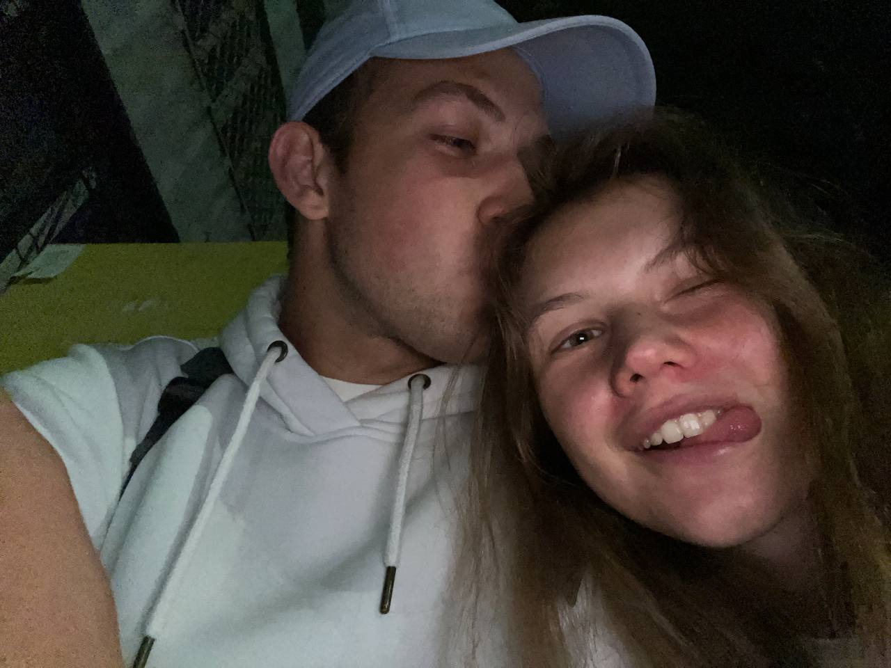
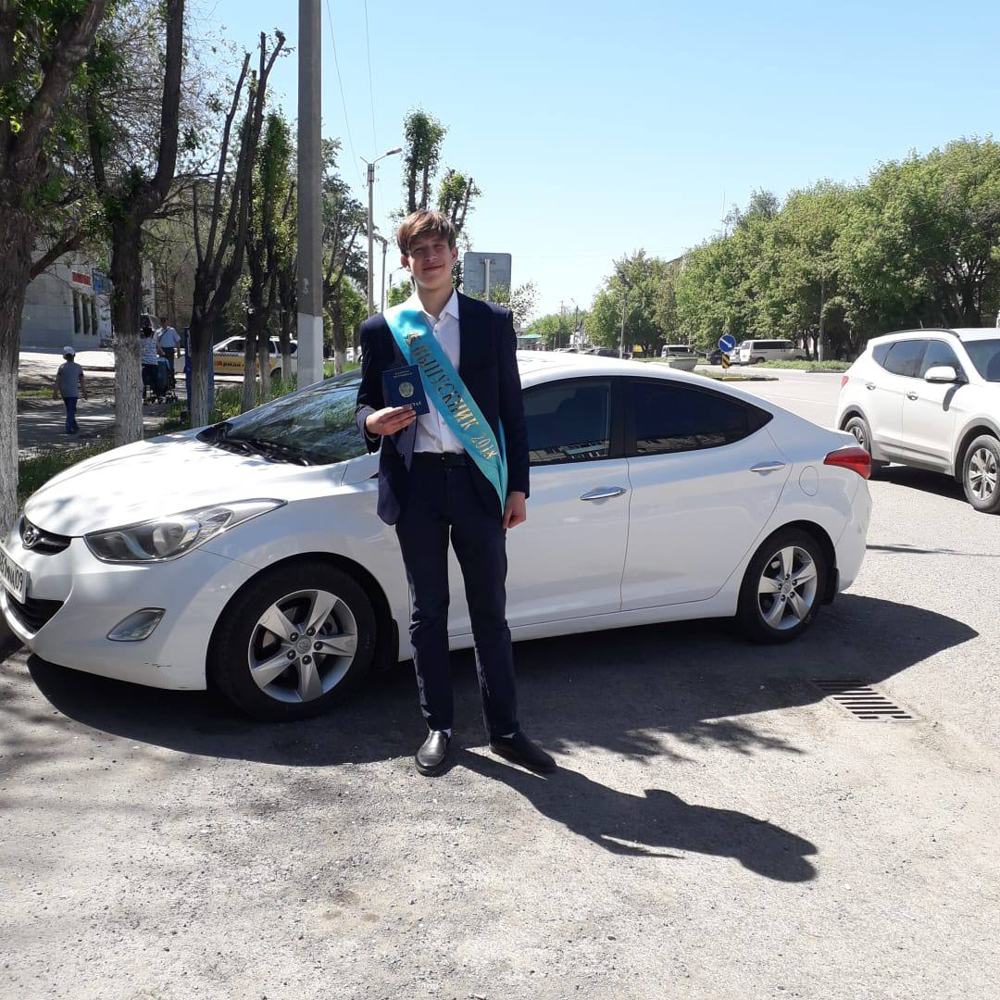

<html lang="ru">
<head>
    <meta charset="UTF-8">
    <meta name="viewport" content="width=device-width, initial-scale=1.0, maximum-scale=1.0, user-scalable=yes">
    <title>Для тебя ❤️</title>
    <link rel="stylesheet" href="https://cdnjs.cloudflare.com/ajax/libs/font-awesome/6.0.0-beta3/css/all.min.css">
    
</head>
<body>
    

    

        

            <button class="tab active" onclick="switchTab('gallery')">
                <i class="fas fa-camera-retro"></i> Фото
            </button>
            <button class="tab" onclick="switchTab('love')">
                <i class="fas fa-heart"></i> Признания
            </button>
            <button class="tab" onclick="switchTab('messages')">
                <i class="fas fa-envelope"></i> Письмо
            </button>
            <button class="tab" onclick="switchTab('surprise')">
                <i class="fas fa-gift"></i> Сюрприз
            </button>
        

        

            

                <h2 class="section-title">
                    <i class="fas fa-camera"></i> Наши моменты
                </h2>
                

                    

                        
                        

                            <i class="fas fa-heart"></i> Именниник
                        

                    

                    

                        
                        

                            <i class="fas fa-heart"></i> Вместе
                        

                    

                    

                        
                        

                            <i class="fas fa-heart"></i> Моя лабубушечка
                        

                    

                    

                        
                        

                            <i class="fas fa-heart"></i> Наше место
                        

                    

                    

                        
                        

                            <i class="fas fa-heart"></i> Крайняя
                        

                    

                    

                        
                        

                            <i class="fas fa-heart"></i> Чемпион
                        

                    

                    

                        
                        

                            <i class="fas fa-heart"></i> Счастливы
                        

                    

                    

                        
                        

                            <i class="fas fa-heart"></i> Поцелуй
                        

                    

                    

                        
                        

                            <i class="fas fa-heart"></i> Мой милашка
                        

                    

                

            

            

                <h2 class="section-title">
                    <i class="fas fa-heartbeat"></i> Признания
                </h2>
                

                    

                        <i class="fas fa-heart"></i>
                        
Ты делаешь мою жизнь волшебной

                        
💕 💗 💓

                    

                    

                        <i class="fas fa-star"></i>
                        
С тобой каждый день особенный

                        
🌟 ✨ 💫

                    

                    

                        <i class="fas fa-sun"></i>
                        
Твоё тепло чувствую всегда

                        
🌞 💛 🥰

                    

                    

                        <i class="fas fa-crown"></i>
                        
Для меня ты лучший

                        
💖 👑 💘

                    

                    

                        <i class="fas fa-infinity"></i>
                        
Наша любовь бесконечна

                        
💞 🌌 💫

                    

                    

                        <i class="fas fa-hand-holding-heart"></i>
                        
Твоя улыбка — мой любимый момент

                        
🥰 💕 😘

                    

                

            

            

                

                    <h2>💌 Моему любимому</h2>
                    <i class="fas fa-heart" style="font-size: 45px; color: #ff69b4; margin: 10px;"></i>
                    
Владислав,

                    
Каждый день с тобой - это особенное чудо. Ты делаешь мой мир ярче, теплее и счастливее. Спасибо тебе за твою заботу, нежность и бесконечную любовь.

                    
Ты - самый удивительный человек в моей жизни, и я бесконечно благодарна судьбе за нашу встречу. Рядом с тобой я чувствую себя любимой и защищенной.

                    
Помни: ты самый важный человек для меня. Твои мечты - это и мои мечты. Мы вместе преодолеем всё, потому что наша любовь сильнее всего.

                    
                    

                        💖 🥰 💕 😘 💗
                    

                    
С днём рождения, мой любименький! 🎉

                    
Навсегда с тобой ❤️

                

            

            

                

                    <h2>🎉 СЮРПРИЗ!</h2>
                    

                    

                        🎈 💝 🎁 💖 🎈
                    

                    
Ты - самый лучший парень на свете!

                    
Я приготовила для тебя особенное послание:

                    

                        "Спасибо, что ты есть у меня!"
                    

                    <button class="surprise-button" onclick="createRainbowHearts()">
                        <i class="fas fa-heart"></i> Нажми на удачу
                    </button>
                    
                    <a href="https://youtu.be/oeLvR-JtDRE?si=L6-DldGyUg0auVVZ" target="_blank" class="youtube-button">
                        <i class="fab fa-youtube"></i>
                        🎵Нажми❤️
                    </a>
                

            

        

    

    

        

            <i class="fas fa-heart"></i>
            <h2>Я ТЕБЯ ЛЮБЛЮ</h2>
            
❤️

            

                💖 💗 💓 💕 💘
            

            <button class="close-modal" onclick="closeLoveModal()">Закрыть</button>
        

    

    
</body>
</html>
